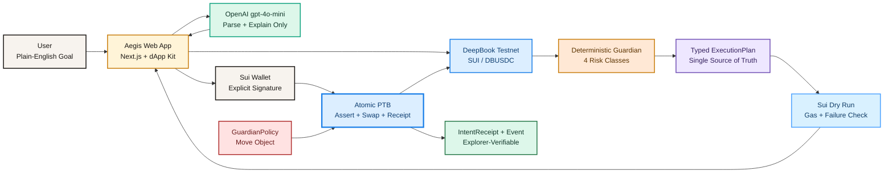
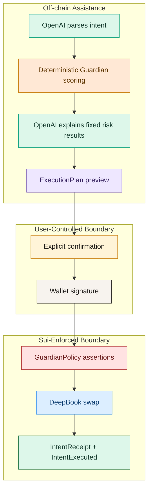
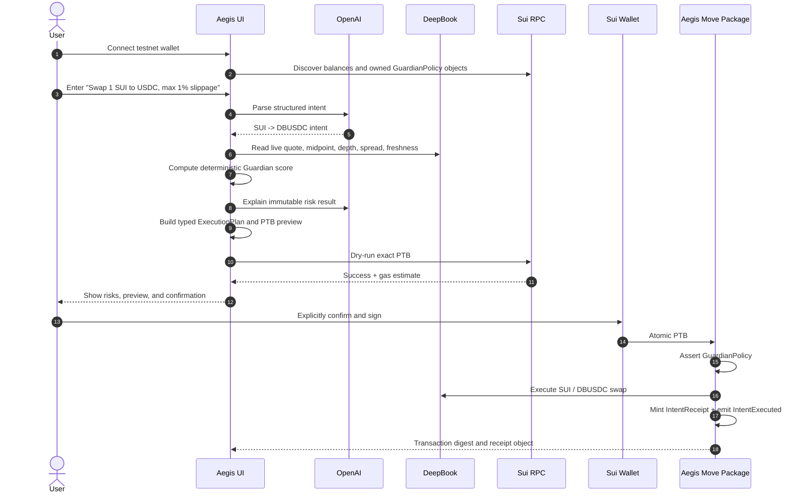
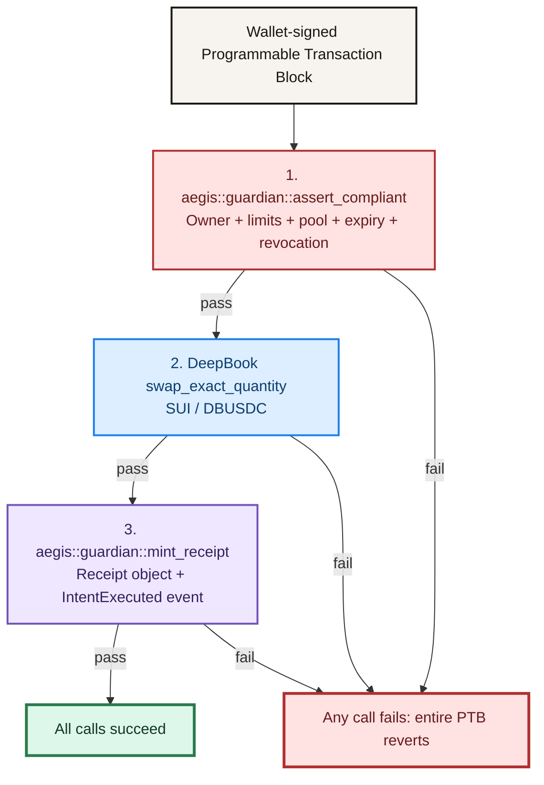

# Aegis

### AI-native intent execution protected by enforceable Sui Move policies

[](https://suiexplorer.com/object/0x7e20acf1c946ad58cd3633ddd1fc37c323c063dc92de138fead88c5dcb42c71d?network=testnet)
[](https://suiexplorer.com/txblock/BAgizt4dbnW3untoXgnkD5ReCyUmJBCDDvJp15VpkoT4?network=testnet)
[](https://platform.openai.com/)
[](#testing)

Aegis is an **Agentic Web Sub-track 3 Intent Engine** built on Sui.

Users describe a financial goal in plain English. Aegis parses the goal, reads live DeepBook market data, computes deterministic risk scores, previews the exact Programmable Transaction Block, dry-runs it, and requires explicit confirmation before signing.

The final transaction is atomic:

```text
GuardianPolicy assertion -> DeepBook swap -> IntentReceipt mint
```

The AI helps users express intent and understand risk. It cannot bypass the user's on-chain Move policy.

---

## Why Aegis

Most AI trading interfaces stop at generating a transaction. That is unsafe because an incorrect model response, stale market snapshot, or compromised frontend can produce a transaction outside the user's intended limits.

Aegis moves the critical execution rules into a Sui Move object:

- Direction-specific SUI and DBUSDC spending ceilings
- Maximum allowed slippage
- Allowed DeepBook pool
- Expiration timestamp
- Owner-only update and revocation
- Persistent revoked state visible on Sui Explorer

Even if the UI is bypassed, the Move policy still rejects non-compliant execution.

## Hackathon Requirements

| Sub-track 3 requirement | Aegis implementation |
| --- | --- |
| Text to PTB to execution | OpenAI intent parser -> typed `ExecutionPlan` -> atomic Sui PTB |
| Human-readable PTB preview | Policy, pool, assets, amounts, minimum output, DEEP fee, risks, and Move calls |
| Guardian catches at least 2 risks | Price impact, liquidity depth, spread, and freshness |
| Explicit confirmation | Confirmation modal for every transaction; warning acknowledgement required |
| Meaningful Sui integration | Owned Move policy, DeepBook swap, atomic PTB, receipt object, and events |

---

## Architecture



### Trust Boundaries



OpenAI is intentionally outside the execution authority boundary. It cannot choose:

- Package IDs
- Pool IDs
- Move targets
- Risk scores
- Guardian verdicts
- Policy limits
- Whether a transaction is executable

---

## End-to-End User Flow



---

## Product UI

### Landing Page

- Responsive cream-white editorial design
- Real Sui wallet connector
- Successful connection redirects to `/dashboard`
- Disconnected users cannot remain on `/dashboard`

### New Intent

- Plain-English intent input
- Quick example intents
- OpenAI parsing with deterministic fallback
- `USDC` accepted as a natural-language alias for DeepBook testnet `DBUSDC`
- Visible structured intent fields

### Testnet Setup

The setup panel checks real connected-wallet state:

- Testnet SUI balance
- DEEP balance for DeepBook fees
- Active owned `GuardianPolicy`

It supports:

- Sui testnet faucet requests
- Live DEEP/SUI order-book quote
- DEEP bootstrap transaction
- DEEP bootstrap dry run before wallet confirmation
- Default seven-day policy creation

### Guardian Analysis

The Guardian displays:

- Overall score from `0` to `100`
- Verdict: `clear`, `warn`, or `block`
- Live, fallback, or stress data mode
- Midpoint and expected output
- Minimum output
- Required DEEP fee
- Snapshot timestamp
- Four individual risk classes
- Plain-English risk explanation

### Human-Readable PTB Preview

The preview and transaction builder use the same typed `ExecutionPlan`, preventing UI-to-transaction drift.

The preview includes:

- GuardianPolicy object ID
- DeepBook pool ID
- Input/output direction
- Input amount and atomic amount
- Expected and minimum output
- Slippage
- DEEP fee budget
- Risk score and verdict
- Snapshot time
- Atomic Move call sequence
- Dry-run gas estimate

### Confirmation and Execution

Execution is blocked unless all gates pass:


Warning verdicts require an additional risk acknowledgement. Stress and fallback data can never execute.

### Real Dashboard Pages

| Page | Data source |
| --- | --- |
| History | Real `IntentExecuted` events for the connected wallet |
| Analytics | Derived from real execution events |
| Guardian Policy | Owned `GuardianPolicy` Move objects |
| My Receipts | Owned `IntentReceipt` Move objects |
| Settings & Readiness | Real network, package, pool, model, policy, and execution status |

No seeded transaction, receipt, policy, balance, or analytics data is used.

---

## Guardian Risk Engine

Aegis calculates risk deterministically. OpenAI only explains the result after it has been computed.

| Risk class | Signal |
| --- | --- |
| Price impact | Difference between ideal midpoint output and live quote |
| Liquidity depth | Visible order-book coverage relative to trade size |
| Market spread | Difference between best bid and ask |
| Market freshness | Age of the latest market observation |

### Scoring

```text
impactScore    = clamp((priceImpactBps / maxSlippageBps) * 62)
depthScore     = clamp((1 - min(depthCoverage, 1)) * 110)
spreadScore    = clamp(spreadBps * 2.6)
freshnessScore = clamp((freshnessSeconds / 300) * 100)

finalScore =
    impactScore    * 0.40 +
    depthScore     * 0.30 +
    spreadScore    * 0.20 +
    freshnessScore * 0.10
```

| Score | Verdict | Execution behavior |
| --- | --- | --- |
| `0-39` | Clear | Confirmation required |
| `40-70` | Warn | Confirmation plus risk acknowledgement |
| `71-100` | Block | Execution disabled |

---

## Move Contract

The Move package is named `aegis`, with the main module:

```text
aegis::guardian
```

### GuardianPolicy Object

```move
public struct GuardianPolicy has key, store {
    id: UID,
    owner: address,
    max_sui_input: u64,
    max_dbusdc_input: u64,
    max_slippage_bps: u64,
    allowed_pool: ID,
    expires_at_ms: u64,
    revoked: bool,
}
```

| Field | Purpose |
| --- | --- |
| `owner` | Only this address can execute, update, or revoke the policy |
| `max_sui_input` | Maximum SUI input in MIST |
| `max_dbusdc_input` | Maximum DBUSDC input in atomic units |
| `max_slippage_bps` | Maximum permitted user-requested slippage |
| `allowed_pool` | The only DeepBook pool permitted by the policy |
| `expires_at_ms` | Sui Clock-based expiration |
| `revoked` | Persistent on-chain revocation state |

### IntentReceipt Object

Each successful execution mints an owned and composable receipt:

```move
public struct IntentReceipt has key, store {
    id: UID,
    policy_id: ID,
    intent_hash: vector<u8>,
    pool: ID,
    direction: u8,
    input_amount: u64,
    min_output: u64,
    guardian_score: u8,
    verdict: String,
    executor: address,
    executed_at_ms: u64,
}
```

### Public Move Functions

| Function | Description |
| --- | --- |
| `create_policy` | Creates an owned GuardianPolicy and emits `PolicyCreated` |
| `update_policy` | Owner-only limit and expiry update; rejected after revocation |
| `revoke_policy` | Owner-only persistent revocation |
| `assert_compliant` | Enforces owner, expiry, revocation, pool, slippage, direction, and ceiling |
| `mint_receipt` | Mints a policy-linked receipt and emits `IntentExecuted` |

### Events

- `PolicyCreated`
- `PolicyUpdated`
- `PolicyRevoked`
- `IntentExecuted`

### Abort Codes

| Code | Name | Meaning |
| --- | --- | --- |
| `0` | `E_NOT_OWNER` | Transaction sender does not own the policy |
| `1` | `E_EXPIRED` | Policy expiration has passed |
| `2` | `E_AMOUNT_EXCEEDED` | Direction-specific amount ceiling exceeded |
| `3` | `E_SLIPPAGE_EXCEEDED` | Requested slippage exceeds policy maximum |
| `4` | `E_POOL_NOT_ALLOWED` | Attempted pool is not permitted |
| `5` | `E_REVOKED` | Policy has been revoked |
| `6` | `E_INVALID_DIRECTION` | Direction is not SUI-to-DBUSDC or DBUSDC-to-SUI |

---

## Atomic PTB



---

## Public Sui Testnet Deployment

| Item | Value |
| --- | --- |
| Network | Sui testnet |
| Package ID | [`0x7e20...c71d`](https://suiexplorer.com/object/0x7e20acf1c946ad58cd3633ddd1fc37c323c063dc92de138fead88c5dcb42c71d?network=testnet) |
| UpgradeCap | `0x6dc878e6c89761c36d14205ebbf345bbb01a609f702c633bbd68dbb4cb389350` |
| Publish transaction | [`78urbD...ExWL`](https://suiexplorer.com/txblock/78urbD7QrRsrCES6FctQbrg5z2cKm5She1kSeSbrExWL?network=testnet) |
| SUI/DBUSDC pool | `0x1c19362ca52b8ffd7a33cee805a67d40f31e6ba303753fd3a4cfdfacea7163a5` |
| Proof policy | [`0x85cc...c560`](https://suiexplorer.com/object/0x85cc37e385369cb39f63cdbe04b5ad6bed8d1ae727ddd091009760dc9b50c560?network=testnet) |
| Atomic proof transaction | [`BAgizt...koT4`](https://suiexplorer.com/txblock/BAgizt4dbnW3untoXgnkD5ReCyUmJBCDDvJp15VpkoT4?network=testnet) |
| Proof receipt | [`0x0c20...bbf8`](https://suiexplorer.com/object/0x0c20dfb27bab5ea1c52ad17b89c5274eb07f8c9727aa9af673329aa8377abbf8?network=testnet) |
| Revocation transaction | [`FKxRbW...wFXh`](https://suiexplorer.com/txblock/FKxRbWg8wc6Gak5rKzEcwwgn9aRrdFtdHg7dpHTiwFXh?network=testnet) |

### Verified Proof Result

```json
{
  "input": "1 SUI",
  "received": "0.749 DBUSDC",
  "deepRequired": 0.023111,
  "guardianScore": 12,
  "verdict": "clear",
  "receiptMinted": true,
  "policyUpdated": true,
  "policyRevoked": true
}
```

The complete machine-readable deployment and proof manifest is available at [`config/testnet.json`](config/testnet.json).

---

## Running Locally

### Requirements

- Node.js 20+
- npm
- A Sui-compatible browser wallet configured for testnet
- Optional: Sui CLI v1.73.1 for Move tests and publication
- Optional: OpenAI API key

### Install

```bash
npm install
```

### Environment

Create `.env.local`:

```bash
OPENAI_API_KEY=your_server_side_key
OPENAI_MODEL=gpt-4o-mini
NEXT_PUBLIC_GUARDIAN_PACKAGE_ID=0x7e20acf1c946ad58cd3633ddd1fc37c323c063dc92de138fead88c5dcb42c71d
```

`OPENAI_API_KEY` remains server-side. Policies are discovered from the connected wallet, so there is no global policy ID.

### Start

```bash
npm run dev
```

Open:

```text
http://localhost:3000
```

---

## UI Testing Guide

### 1. Wallet Access Control

1. Open `/` and connect a Sui testnet wallet.
2. Confirm successful connection redirects to `/dashboard`.
3. Disconnect from the dashboard wallet dropdown.
4. Confirm the app redirects to `/`.
5. Navigate directly to `/dashboard` while disconnected and confirm access is denied.

### 2. Self-Onboarding

1. Open **New Swap**.
2. Confirm the Testnet Setup panel displays real SUI, DEEP, and policy readiness.
3. Use the faucet action if the wallet has no SUI.
4. Acquire DEEP through the DEEP/SUI DeepBook bootstrap action.
5. Confirm the exact transaction dry run passes before the wallet confirmation appears.
6. Create the default GuardianPolicy.
7. Open **Guardian Policy** and confirm the object and Explorer link are real.

### 3. Clear Intent Flow

1. Enter `Swap 1 SUI to USDC, max 1% slippage`.
2. Confirm the parsed stablecoin becomes `DBUSDC`.
3. Confirm live Guardian mode and all four risk rows appear.
4. Confirm the PTB preview shows the policy, pool, amounts, DEEP fee, and three atomic steps.
5. Confirm the dry run passes.
6. Confirm the final modal.
7. Sign in the wallet.
8. Confirm a receipt and Explorer transaction link appear.

### 4. Warning Flow

1. Enter an intent that produces a `warn` score.
2. Confirm execution remains disabled until the risk acknowledgement is checked.
3. Confirm the normal transaction confirmation modal still appears afterward.

### 5. Block and Stress Flow

1. Enable **Stress Mode** and select the clear, warn, or block scenario.
2. Run an intent.
3. Confirm deterministic adverse risk data is shown.
4. Confirm signing is disabled.
5. Disable Stress Mode and confirm live data is restored.

### 6. Policy Lifecycle

1. Open **Guardian Policy**.
2. Update the policy and verify `PolicyUpdated` on Explorer.
3. Revoke the policy and verify the object remains visible with `revoked: true`.
4. Return to **New Swap** and confirm execution cannot proceed with the revoked policy.

### 7. Real Data Pages

After an execution:

- **History** should show the real `IntentExecuted` event.
- **My Receipts** should show the owned `IntentReceipt`.
- **Analytics** should derive metrics from real events.
- **Settings & Readiness** should show the real package, pool, model, and policy status.

---

## Testing

### Automated Commands

```bash
npm test
npm run lint
npm run build
cd move
sui move test
```

### Current Results

| Suite | Result |
| --- | --- |
| TypeScript intent, Guardian, plan, atomic-unit, and gating tests | 6 passed |
| Move policy, ceiling, ownership, expiry, revocation, pool, slippage, direction, and receipt tests | 10 passed |
| ESLint | Passed |
| Next.js production build | Passed |
| Live DeepBook Guardian endpoint | Verified |
| Atomic testnet proof transaction | Verified |

### Move Test Coverage

- Policy creation
- Policy update
- Persistent policy revocation
- Valid SUI-to-DBUSDC trade
- Valid DBUSDC-to-SUI trade
- Wrong owner rejection
- Expired policy rejection
- Revoked policy rejection
- SUI ceiling enforcement
- DBUSDC ceiling enforcement
- Slippage enforcement
- Pool enforcement
- Direction enforcement
- Receipt and event creation

### Reproduce Testnet Proof

The proof helper uses the funded local Sui CLI wallet and the same Mysten/DeepBook SDK transaction path:

```bash
node tools/testnet-proof.mjs
```

It performs:

1. DEEP bootstrap if required
2. Live SUI/DBUSDC quote
3. Exact PTB dry run
4. Atomic policy assertion, DeepBook swap, and receipt mint
5. Policy update
6. Persistent policy revocation

---

## API Routes

| Route | Purpose |
| --- | --- |
| `POST /api/intent` | Parse and validate a plain-English intent |
| `POST /api/guardian` | Read live DeepBook data, calculate deterministic risks, and explain results |
| `POST /api/deep-bootstrap` | Quote visible DEEP/SUI asks for onboarding |
| `POST /api/faucet` | Request Sui testnet faucet funds |

---

## Technology Stack

| Layer | Technology |
| --- | --- |
| Frontend | Next.js 16, React 19, TypeScript |
| Wallet | `@mysten/dapp-kit` |
| Blockchain SDK | `@mysten/sui` |
| Liquidity | `@mysten/deepbook-v3` |
| AI | OpenAI Responses API, `gpt-4o-mini` |
| Validation | Zod |
| Smart contract | Sui Move |
| Testing | Vitest, Move unit tests, ESLint, Next.js build |

---

## Repository Structure

```text
intent-guardian/
|-- config/
|   `-- testnet.json              # Public deployment and proof manifest
|-- move/
|   |-- Move.toml
|   `-- sources/guardian.move     # GuardianPolicy, receipt, events, tests
|-- public/
|   `-- landing.html              # Responsive landing design
|-- src/
|   |-- app/
|   |   |-- api/                  # Intent, Guardian, faucet, DEEP bootstrap
|   |   `-- dashboard/            # Real connected-wallet dashboard
|   |-- hooks/
|   |   `-- useAegisChainData.ts  # Policies, receipts, events, balances
|   `-- lib/
|       |-- guardian.ts           # Deterministic risk engine
|       |-- intent.ts             # Structured intent schema and fallback
|       `-- transaction.ts        # ExecutionPlan, gates, and PTB builders
`-- tools/
    `-- testnet-proof.mjs         # Reproducible end-to-end proof
```

---

## Security Model

### Enforced On-Chain

- Policy ownership
- Allowed pool
- Direction-specific amount ceilings
- Maximum slippage
- Expiration
- Persistent revocation
- Policy-linked receipt minting

### Enforced Before Signing

- Live DeepBook data requirement
- Deterministic risk verdict
- Stress/fallback execution block
- Typed preview and PTB consistency
- Plan freshness of 60 seconds with a Guardian-only live requote action
- Successful exact PTB dry run
- Explicit user confirmation
- Additional warning acknowledgement

### Known Scope

- Current execution pair is SUI/DBUSDC on Sui testnet.
- The project is a hackathon implementation and has not received a production security audit.
- OpenAI explanations are informational; deterministic scoring and Move policy enforcement remain authoritative.

---

## Roadmap

- Add additional DeepBook markets and per-market policy allowlists
- Store signed Guardian snapshots through Walrus
- Add Seal-encrypted private intent preferences
- Add DAO or multisig policy override workflows
- Introduce strategy templates and recurring guarded intents
- Add independent risk model attestations
- Complete production audit and mainnet deployment

---

## License

Hackathon project. Add the intended production license before external distribution.
